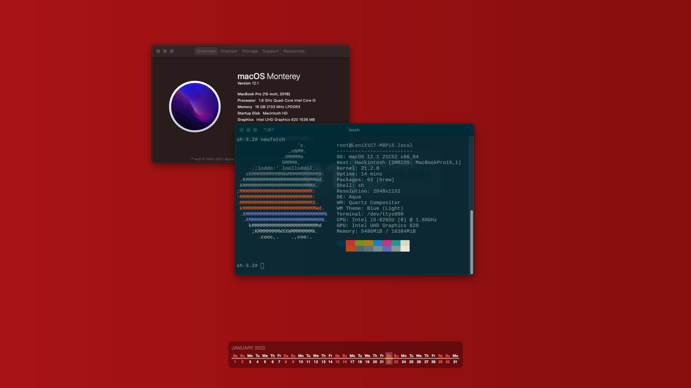

# X1C7-OpenCore-Hackintosh

**Status: Stable | Used daily**


[![OpenCore](https://img.shields.io/badge/version-0.8.9-blue?logo=data:image/svg+xml;base64,PHN2ZyB4bWxucz0iaHR0cDovL3d3dy53My5vcmcvMjAwMC9zdmciIHhtbG5zOnhsaW5rPSJodHRwOi8vd3d3LnczLm9yZy8xOTk5L3hsaW5rIiBoZWlnaHQ9IjU0OSIgdmlld0JveD0iNjcwIDAgNTQ5IDU0OSIgd2lkdGg9IjU0OSIgeG1sbnM6dj0iaHR0cHM6Ly92ZWN0YS5pby9uYW5vIj48bGluZWFyR3JhZGllbnQgaWQ9IkEiIHgxPSI3OS41MDQ0ODQlIiB4Mj0iMjguMTE0MjQ0JSIgeTE9IjU3Ljc2NjU2JSIgeTI9IjgwLjE3OTY1NCUiPjxzdG9wIG9mZnNldD0iMCIgc3RvcC1jb2xvcj0iIzI3ODZkNyIvPjxzdG9wIG9mZnNldD0iMSIgc3RvcC1jb2xvcj0iIzA5NmViNCIvPjwvbGluZWFyR3JhZGllbnQ+PGxpbmVhckdyYWRpZW50IGlkPSJCIiB4MT0iMjEuMDc5NjkzJSIgeDI9Ijg2Ljc2MjEzJSIgeTE9IjEwLjEzNzM5JSIgeTI9IjYzLjI0MzU0OCUiPjxzdG9wIG9mZnNldD0iMCIgc3RvcC1jb2xvcj0iIzAyYWRkYyIvPjxzdG9wIG9mZnNldD0iMSIgc3RvcC1jb2xvcj0iIzA4ZTRjYyIvPjwvbGluZWFyR3JhZGllbnQ+PGxpbmVhckdyYWRpZW50IGlkPSJDIiB4MT0iNDQuNTg1Mzk3JSIgeDI9Ijk0Ljg3Mzc2JSIgeTE9IjEwNi43NjcwODUlIiB5Mj0iNTUuNjM0OCUiPjxzdG9wIG9mZnNldD0iMCIgc3RvcC1jb2xvcj0iIzAwNzBlYyIgc3RvcC1vcGFjaXR5PSIuODcxIi8+PHN0b3Agb2Zmc2V0PSIuNjE0IiBzdG9wLWNvbG9yPSIjMDI5NmUzIiBzdG9wLW9wYWNpdHk9Ii40NTMiLz48c3RvcCBvZmZzZXQ9IjEiIHN0b3AtY29sb3I9IiMwN2RmZDAiIHN0b3Atb3BhY2l0eT0iMCIvPjwvbGluZWFyR3JhZGllbnQ+PGxpbmVhckdyYWRpZW50IGlkPSJEIiB4MT0iNTAlIiB4Mj0iNDguMzIzODE2JSIgeTE9IjcyLjQ5MTkwNSUiIHkyPSI5NC4xNjE3OTclIj48c3RvcCBvZmZzZXQ9IjAiIHN0b3AtY29sb3I9IiMwMDg5ZTUiIHN0b3Atb3BhY2l0eT0iMCIvPjxzdG9wIG9mZnNldD0iMSIgc3RvcC1jb2xvcj0iIzAwNzBlZCIgc3RvcC1vcGFjaXR5PSIuODEiLz48L2xpbmVhckdyYWRpZW50PjxnIHRyYW5zZm9ybT0ibWF0cml4KC43MDcxMDcgLS43MDcxMDcgLjcwNzEwNyAuNzA3MTA3IDYxNC45OTk5OTggMjY5LjI2MDc5OCkiPjxwYXRoIGQ9Ik0yMjkuOTk0IDQ1OS45ODhDMTAyLjk3MiA0NTkuOTg4IDAgMzU3LjAxNiAwIDIyOS45OTRTMTAyLjk3MiAwIDIyOS45OTQgMHMyMjkuOTk0IDEwMi45NzIgMjI5Ljk5NCAyMjkuOTk0LTEwMi45NzIgMjI5Ljk5NC0yMjkuOTk0IDIyOS45OTR6bTAtMTMwLjJjNTUuMTE1IDAgOTkuNzk0LTQ0LjY3OSA5OS43OTQtOTkuNzk0UzI4NS4xMDkgMTMwLjIgMjI5Ljk5NCAxMzAuMiAxMzAuMiAxNzQuODc5IDEzMC4yIDIyOS45OTRzNDQuNjc5IDk5Ljc5NCA5OS43OTQgOTkuNzk0eiIgZmlsbD0idXJsKCNBKSIvPjx1c2UgeGxpbms6aHJlZj0iI0YiIGZpbGw9InVybCgjQikiLz48dXNlIHhsaW5rOmhyZWY9IiNGIiBmaWxsPSJ1cmwoI0MpIi8+PHVzZSB4bGluazpocmVmPSIjRiIgZmlsbD0idXJsKCNEKSIvPjwvZz48ZGVmcyA+PHBhdGggaWQ9IkYiIGQ9Ik00NTkuNzUyIDIyNi43ODRjLTEuMjYyIDM0Ljg0My0yOS45MDYgNjIuNzAyLTY1LjA1NyA2Mi43MDItMzQuMDY1IDAtNjIuMDE5LTI2LjE2NS02NC44NjItNTkuNDk0bC0uMDQ2LjAwMS0uMDAyLS41ODlhNjYuMDEgNjYuMDEgMCAwIDEtLjE5MS01LjAxOWwuMDAzLS41OTVjLTMuMjAzLTUyLjIyNi00Ni41NzMtOTMuNTkxLTk5LjYwNC05My41OTEtNTUuMTE1IDAtMTEyLjM2MiA0My44NDQtMTI5Ljg4MyAxMDcuODYzLTI2LjI2MiA5NS45NTcgNTAuOTYyIDE5OC45MTQgMTI5Ljg0MiAyMjEuODg0bC4xNDEuMDQxaC0uMTAxQzEwMi45NzIgNDU5Ljk4OCAwIDM1Ny4wMTYgMCAyMjkuOTk0UzEwMi45NzIgMCAyMjkuOTk0IDBjMTI1Ljk0OSAwIDIyOC4yNTIgMTAxLjIzOSAyMjkuOTcyIDIyNi43NzlsLS4yMTQuMDA1eiIvPjwvZGVmcz48L3N2Zz4=)](https://github.com/acidanthera/OpenCorePkg)[](https://www.apple.com/macos/ventura)[](https://www.apple.com/macos/ventura)
=======


**DISCLAIMER**
As you embark on your Hackintosh journey you are encouraged to **READ** the entire README and [Dortania](https://dortania.github.io/getting-started/) guides before you start. It will save many a message instructing you to RTFM. I am not an expert, I haven't forced you to do anything, put on your big boy pants and take responsibility for any mess you get yourself into.

All that said I'm happy to help when/where I can. When you encounter bug or want to improve this repo, consider opening an issue or pull request. You can also find a wealth of knowledge on [Reddit](https://www.reddit.com/r/hackintosh/), [TonyMacX86](https://www.tonymacx86.com) or [Google](https://www.google.com).

## Introduction

#### ⚠️ Highlighted OC-0.8.9 EFI changes ⚠️

Note the following changes:

1. Switch to [YogaSMC](https://github.com/zhen-zen/YogaSMC) for media keys (you will need to install the application and the preference pane)
2. Included boot chime and gui picker in the EFI ¯\\\_(ツ)_/¯
3. New power management CPUFriendDataProvider from [madeline-xoxo](https://github.com/madeline-xoxo) see details below.
4. EFI limited to Monterey and Ventura. Big Sur will require different WiFi and Bluetooth kexts.
5. USBMap.kext updated to work for both `MacBookPro15,1 and MacBookPro15,4`.

<details> 
<summary><strong>This is not a guide!</strong></summary>


This is not a guide. It shoud only be used as a reference. I provide some tips and tricks I learned on my journey in building this hackintosh. The best way of using this is as a supplement to the OpenCore guide. If you have questions about how to setup your specific hardware, are unclear about what to do, or would like to compare to the settings I've used.

I understand that some may simply add the OC and Boot folders to their EFI folder. For clarity the EFI partition needs a folder called EFI that contains the Boot and OC folder:

```EFI
EFI (drive)
	EFI
	├── BOOT
	├── OC
```

It should work and your X1C7 should boot and work fine. **You will at minimum need to generate SMBIOS values if you want Apple services to work.** Note that all error reporting/logging has been turned off in the config.plist. You will have a difficult time trouble shooting with the setup provided. You can easily turn on the error reporting and logging if you follow the Dortania guide.

> **NOTE** if you simply wish to copy my EFI please do the following:
>
>1. [Generate SMBIOS values](https://dortania.github.io/OpenCore-Install-Guide/config-laptop.plist/coffee-lake-plus.html#nvram) and add them in the config.plist (MacBookPro15,1 or MacBookPro15,4)
>2. Ensure the value of `showpicker` is  `true` in the config.plist file to provide the opencore menu when booting. 
>3. Prepare your install [USB](https://dortania.github.io/OpenCore-Install-Guide/installer-guide/)
>4. Move the entire EFI folder (with your modifications) to the proper partition on your [USB](https://dortania.github.io/OpenCore-Install-Guide/installer-guide/mac-install.html#setting-up-opencore-s-efi-environment) (or [hard drive](https://dortania.github.io/OpenCore-Post-Install/universal/oc2hdd.html) once the install is complete).
>5. [Install](https://dortania.github.io/OpenCore-Install-Guide/installation/installation-process.html#double-checking-your-work) - You'll need to select <kbd>F12</kbd> to get the boot menu options and **boot from the USB each time the computer restarts** until you've copied the EFI folder onto the hard drive. You may also need to select the correct boot option during install.


</details>

<details> 
<summary><strong>This is a guide!</strong></summary>


- To install macOS follow the guides provided by [Dortania](https://dortania.github.io/OpenCore-Install-Guide/)


</details>  

<details> 
<summary><strong>Credits</strong></summary>


**Shout out** to [NotARobot6969](https://github.com/NotARobot6969) for the DevicesProperties patches to enable HDMI.

### Credit to all these great people whom I don't know but have made my hackintosh dreams a reality:

- [EETagent](https://github.com/EETagent) For orginal T480 OpenCore repo (I like the layout of his guide and used it to create this one)
- The guys from [Acidanthera](https://github.com/acidanthera) that make this possible
- [1Revenger1](https://github.com/1Revenger1) and [leo-labs](https://github.com/leo-labs) for [VoodooRMI](https://github.com/VoodooSMBus/VoodooRMI) and [VoodooSMBus](https://github.com/VoodooSMBus/VoodooSMBus)
- [Apple](http://apple.com) for macOS and HfsPlus.efi
- [corpnewt](https://github.com/corpnewt) for [USBMap](https://github.com/corpnewt/USBMap) and [CPUFriendDataProvider](https://github.com/corpnewt/CPUFriendFriend)
- [headkaze](https://github.com/headkaze) for [Hackintool](https://github.com/headkaze/Hackintool)
- [jwise](https://github.com/jwise) for [HoRNDIS](https://github.com/jwise/HoRNDIS)
- [Mieze](https://github.com/Mieze) for [IntelMausiEthernet](https://github.com/Mieze/IntelMausiEthernet)
- [MSzturc](https://github.com/MSzturc) for [ThinkPad Assistant](https://github.com/MSzturc/ThinkpadAssistant)
- [OpenIntelWireless](https://github.com/OpenIntelWireless/IntelBluetoothFirmware/releases) for [IntelBluetoothFirmware](https://github.com/OpenIntelWireless/IntelBluetoothFirmware), [itlwm](https://github.com/OpenIntelWireless/itlwm) and [HeliPort](hhttps://github.com/OpenIntelWireless/HeliPort)
- [zhen-zen](https://github.com/zhen-zen) for [YogaSMC](https://github.com/zhen-zen/YogaSMC)
- And every other contributor
- People at [r/hackintosh](https://www.reddit.com/r/hackintosh/) for their advice and help
- Useful tools by [CorpNewt](https://github.com/corpnewt) and [headkaze](https://github.com/headkaze/Hackintool)


</details>

<details>
<summary><strong> Other Repositories </strong></summary>


- x1c8-hackintosh repositories:
  - [HJebbour/ThinkPad-X1C8-Hackintosh](https://github.com/HJebbour/ThinkPad-X1C8-Hackintosh)
  - [reactor900/X1C8-Opencore-EFI](https://github.com/reactor900/X1C8-Opencore-EFI)
- x1c7-hackintosh repositories:
  - [suhrmann/x1c7-hackintosh](https://github.com/suhrmann/x1c7-hackintosh)
  - [aidanchandra/x1c7-hackintosh](https://github.com/aidanchandra/x1c7-hackintosh)
  - [672368201/x1c7-hackintosh](https://github.com/672368201/x1c7-hackintosh)
  - [huyhoang8398/x1c7-hackintosh-20R1](https://github.com/huyhoang8398/x1c7-hackintosh-20R1)
  - [EequalsMCsquare/ThinkPad-X1C7-OpenCore](https://github.com/EequalsMCsquare/ThinkPad-X1C7-OpenCore)
  - [notAperson535/x1c7-hackintosh](https://github.com/notAperson535/x1c7-hackintosh)
- x1c6-hackintosh repositories:
  - [tylernguyen/x1c6-hackintosh](https://github.com/tylernguyen/x1c6-hackintosh)
  - [benbender/x1c6-hackintosh](https://github.com/benbender/x1c6-hackintosh)


</details>

<details>
<summary><strong>Hardware</strong></summary>


I used to own two Lenovo ThinkPad X1 Gen 7 laptops, an i5 and an i7. Both worked great (including the touch screen on the i7). I now only have the one computer outlined below:

[](https://pcsupport.lenovo.com/ca/en/products/laptops-and-netbooks/thinkpad-x-series-laptops/thinkpad-x1-carbon-7th-gen-type-20qd-20qe/downloads/ds540232-bios-update-utility-bootable-cd-for-linux-windows-10-64-bit-thinkpad-x1-carbon-7th-gen-x1-yoga-4th-gen)

### X1C7 i5

| Category  | Component                         | Note                                                         |
| --------- | --------------------------------- | ------------------------------------------------------------ |
| Type      | 20QD, 20QE                        |                                                              |
| CPU       | Intel Core i5-8265U               |                                                              |
| GPU       | Intel UHD 620                     |                                                              |
| SSD       | Toshiba 512GB                     | Replaced cursed PM 981 which still doesn't work reliably     |
| Screen    | 14" WQHD - 2560x1440              |                                                              |
| Memory    | 16GB / 2133MHz LPDDR3             |                                                              |
| Battery   | Integrated Li-Polymer 51Wh        | Single battery                                               |
| Camera    | 720p Camera                       |                                                              |
| Wifi & BT | Intel Wireless-AC 9560            | Used AirportItlwm for native Wi-Fi control                   |
| Input     | PS2 Keyboard & Synaptics TrackPad | Switched to[YogaSMC](https://github.com/zhen-zen/YogaSMC) for media keys |


</details>  

<details>
<summary><strong>Main software</strong></summary>


| Component      | Version |
| -------------- | ------- |
| macOS Monterey | 12.6.3 |
| OpenCore       | v0.8.9  |


</details>

<details>
<summary><strong>ACPI Files</strong></summary>


| Component           |
| ------------------- |
| SSDT-AWAC           |
| SSDT-BATT           |
| SSDT-EC-USBX-LAPTOP |
| SSDT-PLUG-DRTNIA    |
| SSDT-PNLF-CFL       |
| SSDT-XOSI           |


</details>

<details>
<summary><strong>Kernel extensions</strong></summary>


| Kext                   | Version |
| --------------------- | ------- |
| AirportItlwm           | 2.1.0   |
| AirportItlwmV (Ventura) | 2.2.0 - alpha |
| AppleALC               | 1.7.6 |
| BlueToolFixup          | 2.6.4 |
| BrightnessKeys | 1.0.2 |
| CPUFriend              | 1.2.6 |
| CPUFriendDataProvider  | 1.01   |
| IntelBluetoothFirmware | 2.2.0   |
| IntelBTPatcher | 2.2.0 |
| IntelMausi             | 1.0.7   |
| Lilu                   | 1.6.3 |
| NVMeFix                | 1.1.0   |
| SMCBatteryManager      | 1.3.0  |
| SMCProcessor           | 1.3.0 |
| SMCSuperIO             | 1.3.0 |
| USBMap                 | 1.0.1   |
| VirtualSMC             | 1.3.0 |
| VoodooI2C              | 2.7.1 |
| VoodooI2CHID           | 2.7.1 |
| VoodooPS2Controller    | 2.3.2   |
| WhateverGreen          | 1.6.4 |
| YogaSMC | 1.5.3 |


</details>

<details><summary><strong>UEFI drivers</strong></summary>
<br>

|     Driver      | Version           |
| ------------- | ----------------- |
|   HfsPlus.efi   | OcBinaryData      |
| OpenRuntime.efi | OpenCorePkg 0.8.9 |


</details>

<details><summary><strong>Neofetch screenshots</strong></summary>
    <br>
    <p float="left">
        
    </p>
</details> 


## Before installation

<details><summary><strong>UEFI settings</strong></summary>
<br>


**Config**


- **Keyboard/Mouse**
  - `Trackpoint` **Enabled**
  - `Trackpad` **Enabled**
- **Display**
  - `Boot Display Device` **ThinkPad LCD**
  - `Total Graphics Memory` **256MB**
  - `Boot Time Extension` **Disabled**
- **CPU**
  - `Intel Hyper-Threading Technology` **Enabled**
- **Thunderbolt**
  - `Thunderbolt BIOS Assist Mode` **Disabled**
  - `Security Level` **No Security**
  - `Support in Pre Boot Environment -> Thunderbolt(TM) device` **Disabled**

**Security**


- `Password` **Disabled**
- `Fingerprint` **Disabled**
- `Security Chip` **Disabled**
- `Memory Protection -> Execution Prevention` **Enabled**
- `Virtualization -> Kernel DMA Protection` **Disabled**
- `Virtualization -> Intel Virtualization Technology` **Enabled**
- `Virtualization -> Intel VT-d Feature` **Disabled**
- `Virtualization -> Enhanced Windows Biometric Security` **Disabled**
- `I/O Port Access -> FingerPrint Reader` **Disabled**
- `I/O Port Access -> Wireless WAN` **Disabled**
- `Secure Boot -> Secure Boot` **Disabled**
- `Intel SGX -> Intel SGX Control` **Disabled**
- `Device Guard` **Disabled**

**Startup**

- `UEFI/Legacy Boot` **UEFI Only**
- `CSM Support` **No**
- `Boot Mode` **Diagnostics** (This can be changed to "Quick" once you know your system is running properly)


</details>  

<details><summary><strong>Own prev-lang-kbd</strong></summary>
<br>


Either add as a string or as a data ( HEX data [(ProperTree)](https://github.com/corpnewt/ProperTree) )

Format is lang-COUNTRY:keyboard

- 🇺🇸 | [0] en_US - U.S --> en-US:0 --> (656e2d55 533a30 in HEX)

| Key           | Type   | Value   |
| ------------- | ------ | ------- |
| prev-lang:kbd | String | en-US:0 |


Pick your keyboard layout here:

[AppleKeyboardLayouts.txt](https://github.com/acidanthera/OpenCorePkg/blob/master/Utilities/AppleKeyboardLayouts/AppleKeyboardLayouts.txt)


</details>

<details>  
<summary><strong>Monterey or Ventura</strong></summary>


The EFI folder is setup for both Monterey and Ventura. I used `MinKernel` and `MaxKernel` values in the config.plist to load the proper kexts based on which OS you are installing. It is no longer setup for Big Sur. It will likely boot but the kexts for WiFi and Bluetooth would need to be replaced for it to work properly.


</details>  

## Post-Install

<details><summary><strong>TrackPad - Disable force touch</strong></summary>


If the **Battery** management **doesn't show up** in the System Preferences after the SSDT-Batt.aml file is added to your ACPI folder and config.plist file. You will not be able to change any trackpad settings. You may experience the annoying behaviour of clicking on the touchpad and it doing a **Force Touch** where the preview of the file is shown. I found this very annoying. You can disable force touch by modifying the file in `~/Library/Preferences/com.apple.AppleMultitouchTrackpad.plist`
Opened it with Propertree and changed **ForceSuppressed** to **True**

Another trick to manage your trackpad, if you can't get the battery to work, is to connect a bluetooth trackpad. Once the bluetooth trackpad is connected you can adjust the settings. Disconnect the bluetooth trackpad and your built in one will maintain those settings.

I used these methods prior to receiving a SSDT-Batt.aml that worked from a friendly Redditor [Galactic_Dev](https://www.reddit.com/user/Galactic_Dev)


</details>

<details><summary><strong>Generate your own SMBIOS</strong></summary>


[GenSMBIOS](https://github.com/corpnewt/GenSMBIOS)

Use GenSMBIOS to create your own serial #... based off of your preferred model.

- MacBookPro15,1 -`What I used`
- MacBookPro15,4 -`Reported as used by others`

**Note:** If you use a different SMBIOS model than either of the two above. The provided USB mapping will not work. You will need to edit the **USBMap.kext file**.  You can right click on the file and select **Show Package Contents**.  From there you can open the Info.plist file in ProperTree and change MacBookPro15,1 to whatever Model ID you've chosen. This will provide a working USBMap.kext.


</details>

<details>  
<summary><strong>CPUFriend power management</strong></summary>


Thanks to [madeline-xoxo](https://github.com/madeline-xoxo) for the new CPUFriendDataProvider options.

> The default CPUFriendDataProvider.kext has changed. **It is now set to a battery-conserving "CPUFriendDataProvider.kext". If you'd like more performance you can switch it to the more performant "CPUFriendDataProvider_PERF.kext".**

The default CPUFriendDataProvider lasts far, far longer and charges much faster. You can expect battery life of about 18 hours or so in light usage, and anywhere between 14-15 hours or so with heavy usage (update: after writing this whole note, while on battery power, it is *still* on 100%. This goes to show how much of a difference tuning makes). The PERF option will give you far superior performance (boost, base and avg clocks are all set higher and MBA battery features are disabled), but will take a heavy toll on battery life. You can expect about 6 hours with light usage, and 2-3 hours with heavy usage. Obviously, these are two extremes, and if you want to customize a CPUFriendDataProvider, you can make your own using CorpNewt's amazing [CPUFriendFriend](https://github.com/corpnewt/CPUFriendFriend). If you don't know what you need, stick with the default. It'll grant you far superior battery life while still providing the boost needed for 1080p60 video streaming. 

In terms of charging speed, you'll get from 0% to 100% in about 45 minutes to an hour using BATT, and 0% to 100% in 1 and a half to 2 hours using PERF in my experience.

To change the CPU tuning simply:

1. Rename the existing CPUFriendDataProvider.kext to something like CPUFriendDataProvider_BATT.kext.
2. Rename CPUFriendDataProvider_PERF.kext to CPUFriendDataProvider.kext.
3. Reboot and enjoy.


</details>

<details>  
<summary><strong>Audio Setup</strong></summary>


### Audio Setup enable both top and bottom speakers:

| Key       | Value    |
| --------- | -------- |
| boot-args | alcid=71 |

Using the above boot-arg to initially setup your config.plist file. This will enable the top and bottom speakers in the **System Preferences>Sound** allowing you to select either set of speakers. To combine the two you'll need to open **Audio MIDI Setup** (use Spotlight to find and open it) and create an **Aggregate Device** with both sets of speakers. Unfortunately you can't control the volume of an Aggregate Device with the volume keys. You'll need to install a utility as highlighted below.

Create **Multi-output device** or **Aggregate Device** in **Audio MIDI Setup** controller for all speakers - use utility like [AggregateVolumeMenu](https://github.com/adaskar/AggregateVolumeMenu) to control the volume

- See description here [Change Volume on Aggregate Sound](https://gurhanpolat.medium.com/change-volume-on-aggregate-sound-815fd575347a)

If you're happy with the setup above you can use the guide to replace alcid=71 per below:

- Add audio codec to DeviceProperties - layout-id | data | **47000000**


</details>

## Status

<details>  
<summary><strong>What's working ✅</strong></summary>


- [x] Battery percentage
- [x] Bluetooth - Intel Wireless-AC 9560 
- [x] CPU power management
- [x] HDMI - `HDMI is working fine through the HDMI port, haven't tested via the USB-C port though. Doesn't work if plugged in at boot until you unplug and replug.`
- [x] GPU UHD 620 hardware acceleration / performance (if not working add `-igfxmlr` flag to `boot-args` in config.plist [issue #6](https://github.com/seven-of-eleven/Lenovo-ThinkPad-X1C7-OC-Hackintosh/issues/6))
- [x] iMessage, FaceTime, App Store, iTunes Store. **Generate your own SMBIOS**
- [x] Intel I219-V Ethernet port -`works with the Lenovo dongle`
- [x] Keyboard `Volume and brightness hotkeys. Another media keys with YogaSMC.`
- [x] Realtek® ALC3286 ("ALC285") Audio -`See setup above`
- [x] Sleep/Wake 
- [x] TouchPad `1-5 fingers swipe gestures`
- [x] TrackPoint  `Works perfectly. Just like on Windows or Linux.`
- [x] USB Ports `USB Map is different for devices with Windows Hello camera.`
- [x] Web camera
- [x] Wifi - Intel Wireless-AC 9560
- [x] Multi-Touch Screen
- [x] Graphical Boot menu `OpenCanopy` 


</details>

<details>  
<summary><strong>What's not working ⚠️</strong></summary>


- [ ] Fingerprint reader - `There is finally after many years working driver for Linux (python-validity), don't expect macOS driver any time.`
- [ ] Samsung PM 981 NVME - `Still unstable. Could work for some, not for others. (In most cases which it does work, it will give a "hash mismatch" error every so often.)`
- [ ] Microphone -`Microphone doesn't work due to the fact that there is no AppleALC layout specifically for the X1C7. This will require some knowledge on AppleALC to get working; specifically on how pin configs work and how to make custom layouts. Maybe for someone more experienced? If you're willing to give it a shot,` [here's a codec#0 dump I made under xubuntu](https://pastebin.com/HZu88UPr). `Remember to PR if you get it working!`


</details>  

<details>  
<summary><strong>Untested</strong></summary>


- [ ] Thunderbolt - `No device to test.`
- [ ] Boot chime -`it is enable in the EFI but I don't use it personally`
- [ ] FireVault 2  -`should work just haven't bothered with it`
- [ ] Sidecar wired
- [ ] Sidecar wireless
- [ ] Windows/Linux from OC boot menu - `It's best practice to not boot from OC when planning to perform firmware upgrade`


</details>
