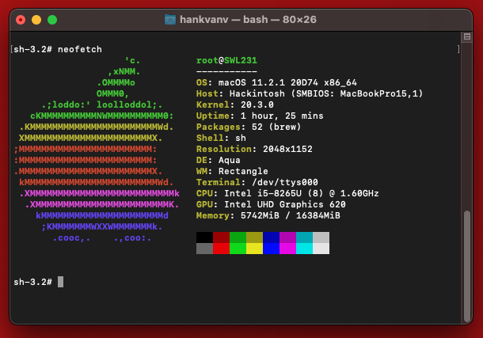

# X1C7-OpenCore-Hackintosh

**Status: Work In Progress | Stable | Used daily**

**DISCLAIMER:**
As you embark on your Hackintosh journey you are encouraged to **READ** the entire README and [Dortania](https://dortania.github.io/getting-started/) guides before you start. It will save many a message instructing you to RTFM. I am not an expert, I haven't forced you to do anything, put on your big boy pants and take responsibility for any mess you get yourself into.

When you encounter bug or want to improve this repo, consider opening an issue or pull request. You can also find a wealth of knowledge on [Reddit](https://www.reddit.com/r/hackintosh/), [TonyMacX86](https://www.tonymacx86.com) or [Google](https://www.google.com).

## Introduction

 

<strong>General knowledge & credits</strong>

- To install macOS follow the guides provided by [Dortania](https://dortania.github.io/OpenCore-Install-Guide/)

- Useful tools by [CorpNewt](https://github.com/corpnewt) and [headkaze](https://github.com/headkaze/Hackintool)

- [CREDITS](CREDITS.md) file

  

<strong>Hardware</strong>

 

I presently own two Lenovo ThinkPad X1 Gen 7 units which are outlined below:

### X1C7 i5

| Category  | Component                                       | Note                                                         |
| --------- | ----------------------------------------------- | ------------------------------------------------------------ |
| Type      | 20QD, 20QE                                      |                                                              |
| CPU       | Intel Core i5-8265U                             |                                                              |
| GPU       | Intel UHD 620                                   |                                                              |
| SSD       | Toshiba 512GB                                   | Replaced cursed PM 981 which still doesn't work reliably     |
| Screen    | 14" WQHD - 2560x1440                            |                                                              |
| Memory    | 16GB / 2133MHz LPDDR3                           |                                                              |
| Battery   | Integrated Li-Polymer 51Wh                      | Single battery                                               |
| Camera    | 720p Camera                                     |                                                              |
| Wifi & BT | Intel Wireless-AC 9560                          | Use AirportItlwm for your macOS version and enjoy native Wi-Fi control, or use Heliport app. |
| Input     | PS2 Keyboard & Synaptics TrackPad (touchscreen) | I'm using ThinkPad Assistant an alternative most seem to be moving to [YogaSMC](https://github.com/zhen-zen/YogaSMC) for media keys like microphone switch, etc. |

### X1C7 i7

| Category  | Component                                       | Note                                                         |
| --------- | ----------------------------------------------- | ------------------------------------------------------------ |
| Type      | 20QD, 20QE                                      |                                                              |
| CPU       | Intel Core i7-8565U                             |                                                              |
| GPU       | Intel UHD 620                                   |                                                              |
| SSD       | WD 1TB                                          | Replaced cursed PM 981 which still doesn't work reliably     |
| Screen    | 14" FHD 1920x1080                               | Multi-Touch                                                  |
| Memory    | 16GB / 2133MHz LPDDR3                           |                                                              |
| Battery   | Integrated Li-Polymer 51Wh                      | Single battery                                               |
| Camera    | 720p Camera                                     |                                                              |
| Wifi & BT | Intel Wireless-AC 9560                          | Use AirportItlwm for your macOS version and enjoy native Wi-Fi control, or use Heliport app. |
| Input     | PS2 Keyboard & Synaptics TrackPad (touchscreen) | I'm using ThinkPad Assistant an alternative most seem to be moving to [YogaSMC](https://github.com/zhen-zen/YogaSMC) for media keys like microphone switch, etc. |

  

<strong>Main software</strong>

 

| Component      | Version  |
| -------------- | -------- |
| macOS Catalina | Untested |
| macOS Big Sur  | 11.2.2   |
| OpenCore       | v0.6.5   |

<strong>ACPI Files</strong>

 

| Component              |
| ---------------------- |
| SSDT-AWAC              |
| SSDT-BATT              |
| SSDT-EC-USBX-LAPTOP    |
| SSDT-PLUG-DRTNIA       |
| SSDT-PNLF-CFL          |
| SSDT-ThinkPad_ClickPad |
| SSDT-X1C6-KBRD         |
| SSDT-XOSI              |

<strong>Kernel extensions</strong>

 

| Kext                   | Version |
| :--------------------- | ------- |
| AirportItlwm           | 1.2.0   |
| AppleALC               | 1.5.6   |
| CPUFriend              | 1.2.3   |
| CPUFriendDataProvider  | 1.00    |
| IntelBluetoothFirmware | 1.1.2   |
| IntelBluetoothInjector | 1.1.2   |
| IntelMausi             | 1.0.5   |
| Lilu                   | 1.5.0   |
| SMCBatteryManager      | 1.1.9   |
| SMCProcessor           | 1.1.9   |
| SMCSuperIO             | 1.1.9   |
| USBMap                 | 1.0.0   |
| VirtualSMC             | 1.1.9   |
| VoodooI2C              | 2.6.3   |
| VoodooI2CHID           | 1.0     |
| VoodooPS2Controller    | 2.2.0   |
| WhateverGreen          | 1.4.6   |

<strong>UEFI drivers</strong>

 

|     Driver      | Version           |
| :-------------: | ----------------- |
|   HfsPlus.efi   | OcBinaryData      |
| OpenRuntime.efi | OpenCorePkg 0.6.5 |

    
<strong>Neofetch screenshots</strong>

     
    

        
    

 

## Before installation

  

<strong>UEFI settings</strong>

 

**Config**

- **Keyboard/Mouse**
  - `Trackpoint` **Enabled**
  - `Trackpad` **Enabled**
- **Display**
  - `Boot Display Device` **ThinkPad LCD**
  - `Total Graphics Memory` **256MB**
  - `Boot Time Extension` **Disabled**
- **CPU**
  - `Intel Hyper-Threading Technology` **Enabled**
- **Thunderbolt**
  - `Thunderbolt BIOS Assist Mode` **Disabled**
  - `Security Level` **No Security**
  - `Support in Pre Boot Environment -> Thunderbolt(TM) device` **Disabled**

**Security**

- `Password` **Disabled**
- `Fingerprint` **Disabled**
- `Security Chip` **Disabled**
- `Memory Protection -> Execution Prevention` **Enabled**
- `Virtualization -> Kernel DMA Protection` **Disabled**
- `Virtualization -> Intel Virtualization Technology` **Enabled**
- `Virtualization -> Intel VT-d Feature` **Disabled**
- `Virtualization -> Enhanced Windows Biometric Security` **Disabled**
- `I/O Port Access -> FingerPrint Reader` **Disabled**
- `I/O Port Access -> Wireless WAN` **Disabled**
- `Secure Boot -> Secure Boot` **Disabled**
- `Intel SGX -> Intel SGX Control` **Disabled**
- `Device Guard` **Disabled**

**Startup**

- `UEFI/Legacy Boot` **UEFI Only**
- `CSM Support` **No**
- `Boot Mode` **Diagnostics** (This can be changed to "Quick" once you know your system is running properly)

  

<strong>Own prev-lang-kbd</strong>

 

Either add as a string or as a data ( HEX data [(ProperTree)](https://github.com/corpnewt/ProperTree) )

Format is lang-COUNTRY:keyboard

- 🇺🇸 | [0] en_US - U.S --> en-US:0 --> (656e2d55 533a30 in HEX)

| Key           | Type   | Value   |
| ------------- | ------ | ------- |
| prev-lang:kbd | String | en-US:0 |

Pick your keyboard layout here:

[AppleKeyboardLayouts.txt](https://github.com/acidanthera/OpenCorePkg/blob/master/Utilities/AppleKeyboardLayouts/AppleKeyboardLayouts.txt)

## Post-Install

  

<strong>TrackPad - Disable force touch</strong>

 

If the **Battery** management **doesn't show up** in the System Preferences after the SSDT-Batt.aml file is added to your ACPI folder and config.plist file. You will not be able to change any trackpad settings. You may experience the annoying behaviour of clicking on the touchpad and it doing a **Force Touch** where the preview of the file is shown. I found this very annoying. You can disable force touch by modifying the file in `~/Library/Preferences/com.apple.AppleMultitouchTrackpad.plist`
Opened it with Propertree and changed **ForceSuppressed** to **True**

Another trick to manage your trackpad, if you can't get the battery to work, is to connect a bluetooth trackpad. Once the bluetooth trackpad is connected you can adjust the settings. Disconnect the bluetooth trackpad and your built in one will maintain those settings.

I used these methods prior to receiving a SSDT-Batt.aml that worked from a friendly Redditor [Galactic_Dev](https://www.reddit.com/user/Galactic_Dev)

  

  

<strong>Generate your own SMBIOS</strong>

 

[GenSMBIOS](https://github.com/corpnewt/GenSMBIOS)

Use GenSMBIOS to create your own serial #... based off of your preferred model.

- MacBookPro15,1 -`What I used`
- MacBookPro15,4 -`Reported as used by others`

**Note:** If you use a different SMBIOS model than the MacbookPro15,1 that I've used. The provided USB mapping will not work.  You will need to edit the **USBMap.kext file**.  You can right click on the file and select **Show Package Contents**.  From there you can open the Info.plist file in ProperTree and change MacBookPro15,1 to whatever Model ID you've chosen. This should provide a working USBMap.kext.

  

  

<strong>CPUFriend power management</strong>

 
Generate CPUFriendDataProvider for your machine [here](https://github.com/fewtarius/CPUFriendFriend) or use those I've provided. My files are set for power conservation over performance. Highly recommended that you use power management.

  

  

<strong>Audio Setup</strong>

 

## Audio Setup enable both top and bottom speakers:

| Key       | Value    |
| --------- | -------- |
| boot-args | alcid=71 |

Using the above boot-arg to initially setup your config.plist file. This will enable the top and bottom speakers in the **System Preferences>Sound** allowing you to select either set of speakers. To combine the two you'll need to open **Audio MIDI Setup** (use Spotlight to find and open it) and create an **Aggregate Device** with both sets of speakers. Unfortunately you can't control the volume of an Aggregate Device with the volume keys. You'll need to install a utility as highlighted below.

Create **Multi-output device** or **Aggregate Device** in **Audio MIDI Setup** controller for all speakers - use utility like [AggregateVolumeMenu](https://github.com/adaskar/AggregateVolumeMenu) to control the volume

- See description here [Change Volume on Aggregate Sound](https://gurhanpolat.medium.com/change-volume-on-aggregate-sound-815fd575347a)

If you're happy with the setup above you can use the guide to replace alcid=71 per below:

- Add audio codec to DeviceProperties - layout-id | data | **47000000**

  

## Status

  

<strong>What's working ✅</strong>

- [x] Battery percentage
- [x] Bluetooth - Intel Wireless-AC 9560 
- [x] CPU power management
- [x] GPU UHD 620 hardware acceleration / performance 
- [x] iMessage, FaceTime, App Store, iTunes Store. **Generate your own SMBIOS**
- [x] Intel I219-V Ethernet port -`works with the Lenovo dongle`
- [x] Keyboard `Volume and brightness hotkeys. Another media keys with ThinkPad Assistant.`
- [x] Realtek® ALC3286 ("ALC285") Audio -`See setup above`
- [x] Sleep/Wake 
- [x] TouchPad `1-5 fingers swipe gestures`
- [x] TrackPoint  `Works perfectly. Just like on Windows or Linux.`
- [x] USB Ports `USB Map is different for devices with Windows Hello camera.`
- [x] Web camera
- [x] Wifi - Intel Wireless-AC 9560
- [x] Multi-Touch Screen
- [x] Graphical Boot menu `OpenCanopy (It does work. Not included in OC folder as I skip the boot menu.)` 

  

  

<strong>What's not working ⚠️</strong>

- [ ] Fingerprint reader - `There is finally after many years working driver for Linux (python-validity), don't expect macOS driver any time soon.`
- [ ] PM 981 - `Still unstable. Could work for some, not for others.`
- [ ] HDMI -`Was not able to get it working through HDMI or USB-C port (others have reported it working) any help here would be appreciated.`
- [ ] Microphone -`I haven't done much research into this. I plug in a headset and that works`

  

  

<strong>Untested</strong>

- [ ] Thunderbolt  `No device to test.`
- [ ] Boot chime
- [ ] FireVault 2
- [ ] Sidecar wired
- [ ] Sidecar wireless
- [ ] Windows/Linux from OC boot menu `It's best practice to not boot from OC when planning to perform firmware upgrade`

 